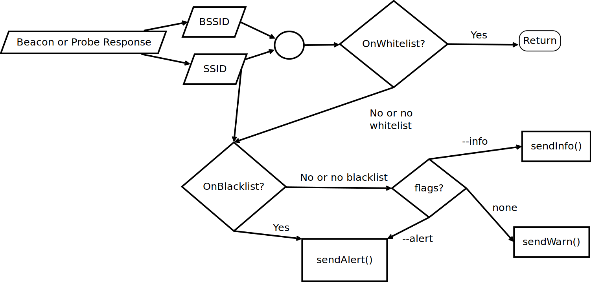

# Rogue Access Point Detection

* [Characteristics](#characteristics)
* [General Approach](#general-approach)
  * [Black and Whitelists](#black-and-whitelists)
  * [How Lists are Used](#how-lists-are-used)
  * [knownAP](#knownap)
* [Hearing Map](#hearing-map)
* [Problem: Detecting Two APs with Similar ESSID/BSSID Combination Within Allowed Range](#problem-detecting-two-aps-with-similar-essidbssid-combination-within-allowed-range)

Created by [gh-md-toc](https://github.com/ekalinin/github-markdown-toc)

## Characteristics

* scalable (it does not make any difference, if one service sees all or just one frame, therefore multiple workers can get started based on load)
* shared storage may needed to allow scalability (depends on [configuration](#how-lists-are-used), e.g. if a knownAP list should be saved)
* needs network connection to: RabbitMQ

## General Approach

The Rogue Access Point detection looks for new/forbidden ESSIDs or ESSID/BSSID combinations seen by the remote capture. Alerts, warnings or infos are published consequently.

### Black and Whitelists

*Blacklists* are list of forbidden ESSIDs. There is no use in blacklisting BSSIDs as well, as differenciating between allowed BSSIDs should be done in white lists.

*Whitelists* are mappings of ESSIDs to a list of BSSIDs. Such, if a ESSID is on the allowed list, but the BSSID is not, this AP is not allowed. It is recommended to put ESSIDs of the whitelist on the blacklist, to ensure that every usage of this ESSID without allowed BSSID provokes an alert.

Both, black- and whitelists are yaml formatted text files. They are called lists/whitelist.yml and lists/blacklist.yml.

Whitelists are scalars mapped to sequences, such as:

```
"ESSID1":
- BSSID1
"ESSID2":
- BSSID2
- BSSID3
...
```

Blacklists are just sequences, such as:
```
- "ESSID1"
- "ESSID2"
```

### How Lists are Used 

* Blacklist in use only
  * -> Alert if BSSID in black list was seen 
* Whitelist in use only 
  * -> warn if ESSID/BSSID is not on whitelist and save to knownAP (if option --train is used)
  * -> alert if ESSID/BSSID is not on whitelist (if option --alert is used)
  * -> info if ESSID/BSSID is not on whitelist (if option --info is used) and save to knownAP (if option --train is used)
* Black- and whitelist in use
  * -> warn if ESSID/BSSID is not on whitelist and save to knownAP (if option --train is used)
  * -> alert if BSSID in on blacklist **and** ESSID/BSSID is not on whitelist
  * -> info if ESSID/BSSID is not on whitelist (if option --info is used) and save to knownAP (if option --train is used)
* Neither blacklist nor whitelist in use
  * -> warn if ESSID/BSSID is not on knownAP (if existence) and save to knownAP (if option --train is used)
  * -> info if ESSID/BSSID is not on knownAP (if existence; if option --info is used) and save to knownAP (if option --train is used)
  * -> alert if ESSID/BSSID is not on knownAP (if existence; if option --alert is used)



### knownAP

Depending on the configuration new APs are saved to a lists/knownAP.yml file. This is formatted the same way like a whitelist. Thus, it could be used after some time as a whitelist (training data).

## Hearing Map
**TODO** -> Kismet's pcap-ng output does not give the needed information for making/using hearing maps yet

It is possible to add a hearing map instead of a whitelist, to ensure that only ESSID/BSSID combinations are allowed, which make sense regarding the physical location of a remote capture. Otherwise an attacker could use a valid ESSID/BSSID combination seen in an other room or building and use this to not get detected.

Such a hearing map is stored in a yaml file and follows this layout:

```
'ESSID1':
  - 'BSSID1':
      - 'AP1'
'ESSID2':
  - 'BSSID2'
      - 'AP1'
      - 'AP2'
  - 'BSSID3'
      - 'AP3'
```

Such a file layout can be created instead of a knownAP list to use training data as a hearing map afterwards (see [list usage](#how-lists-are-used) and [knownAP](#knownap)).

## Problem: Detecting Two APs with Similar ESSID/BSSID Combination Within Allowed Range 
**TODO**

* if the allowed AP is seeing the packages itself, without sending them?
* signal strength comparing?

